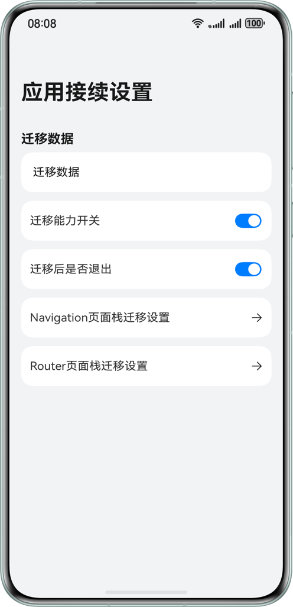

# 基于应用接续能力实现跨设备迁移(ArkTS)

## 项目简介

本示例基于应用接续能力(ArkTS)实现了跨设备页面与数据迁移。示例包含手机端与平板端两个入口模块，并通过公共功能模块统一管理接续配置，开发者可以基于本示例实现迁移数据、迁移开关、页面栈迁移等能力，适用于实现更灵活的跨端连续体验。

## 效果预览

| 首页                                          |
|---------------------------------------------|
|  |

## 使用说明

1. 打开应用，进入接续设置页面并填写迁移数据。
2. 根据需求开启或关闭迁移能力开关、迁移后是否退出、Navigation/Router页面栈是否迁移。
3. 在支持接续的设备间触发应用接续。
4. 在目标设备查看页面与数据恢复效果。
5. Router页面栈迁移开关打开时，源端和对端关于首页/Router页面显示一致，关闭时，接续端显示首页。
6. Navigation页面栈迁移开关打开时，源端和对端关于首页/Navigation页面显示一致，关闭时，接续端显示首页。

## 工程目录

```
├──features                                	    // 功能模块目录
│  └──continue                             	    // 接续功能HAR模块
│     └──src/main/ets                      	    // continue模块ArkTS源码目录
│        ├──pages                          	    // 页面目录
│        │  ├──AbilityAIndex.ets           	    // 平板AbilityA侧接续设置页
│        │  ├──ContinueIndex.ets           	    // 接续设置主页面
│        │  ├──ContinueNavigationPage.ets  	    // Navigation页面栈迁移设置页
│        │  └──ContinueRouterPage.ets      	    // Router页面栈迁移设置页
├──product                                 	    // 产品模块目录
│  ├──phone                                	    // 手机entry模块目录
│  │  └──src/main                          	    // 手机模块主源码目录
│  │     ├──ets                             	// 手机模块ArkTS源码目录
│  │     │  ├──entryability                 	// 手机入口Ability目录
│  │     │  │  └──EntryAbility.ets          	// 手机入口Ability实现
│  │     │  ├──entrybackupability            	// 手机备份扩展Ability目录
│  │     │  │  └──EntryBackupAbility.ets    	// 手机备份扩展Ability实现
│  │     │  └──pages                        	// 手机页面目录
│  │     │     ├──Index.ets                  	// 手机首页
│  │     │     └──ContinueRouterPage.ets    	// 手机Router迁移设置页
│  │     └──module.json5                    	// 手机模块配置文件
│  └──tablet                                 	// 平板/电脑entry模块目录
│     └──src/main                            	// 平板/电脑模块主源码目录
│        ├──ets                             	// 平板/电脑模块ArkTS源码目录
│        │  ├──abilitya                       	// 平板/电脑入口Ability目录
│        │  │  └──AbilityA.ets               	// 平板/电脑入口Ability实现
│        │  ├──applicationbackupability      	// 平板/电脑备份扩展Ability目录
│        │  │  └──ApplicationBackupAbility.ets	// 平板/电脑备份扩展Ability实现
│        │  └──pages                        	// 平板/电脑页面目录
│        │     ├──Index.ets                  	// 平板/电脑首页
│        │     └──ContinueRouterPage.ets     	// 平板/电脑Router迁移设置页
│        └──module.json5                     	// 平板/电脑模块配置文件
└──build-profile.json5                       	// 工程构建配置文件
```

## 具体实现

1. 接续能力开关：页面开关触发 `setMissionContinueState(AbilityConstant.ContinueState.ACTIVE/INACTIVE)` 控制当前任务是否可接续。
2. 迁移后退出控制：通过 `wantParam[wantConstant.Params.SUPPORT_CONTINUE_SOURCE_EXIT_KEY]` 传递源端是否退出配置。
3. Navigation页面栈迁移：源端在 `onContinue` 写入 `wantParam['navPathStack']`，目标端在 `onCreate/onNewWant` 读取
   `want.parameters.navPathStack` 并恢复到 `AppStorage('NavPathInfo')`，页面再重建 `NavPathStack`。
4. Router页面栈迁移：通过 `wantParam[wantConstant.Params.SUPPORT_CONTINUE_PAGE_STACK_KEY]` 传递是否迁移Router栈，目标端在
   `onWindowStageRestore` 按该标记决定是否回落到 `pages/Index`。

### 相关权限

不涉及

### 依赖

不涉及

## 约束与限制

1. 本示例仅支持标准系统上运行，支持设备：手机、平板、电脑。
2. HarmonyOS系统：HarmonyOS 6.0.0 Release及以上。
3. DevEco Studio版本：DevEco Studio 6.0.0 Release及以上。
4. HarmonyOS SDK版本：HarmonyOS 6.0.0及以上。
5. 双端设备需要登录同一华为账号。
6. 双端设备建议打开Wi-Fi和蓝牙开关。条件允许时，建议双端设备接入同一个局域网，可提升数据传输的速度。
7. 应用接续只能在同应用（UIAbility）之间触发，双端设备都需要有该应用。
